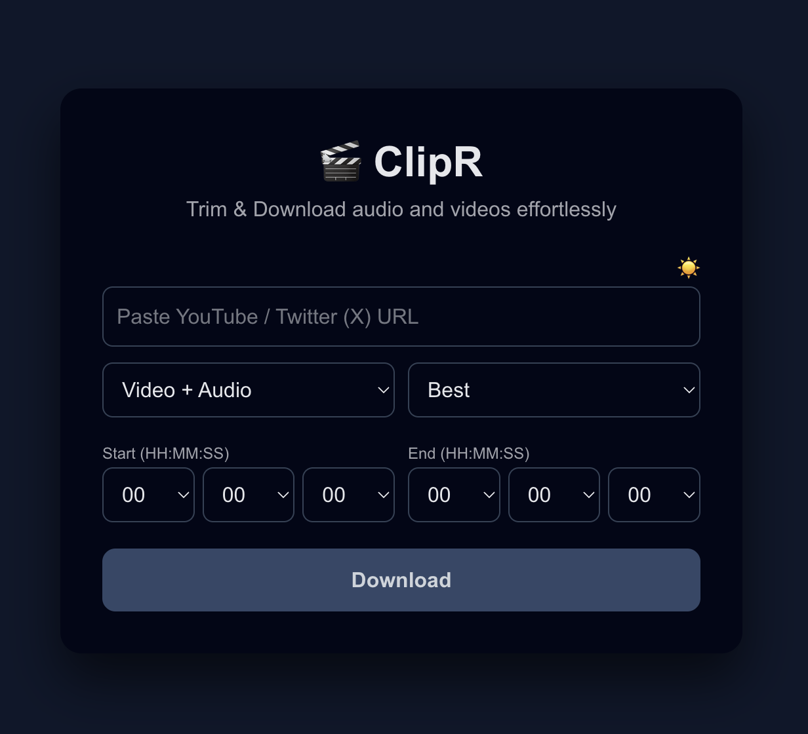
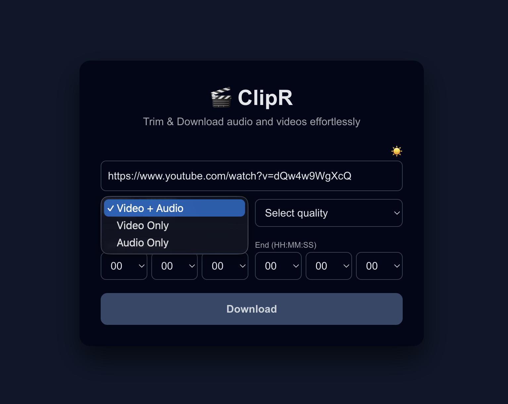
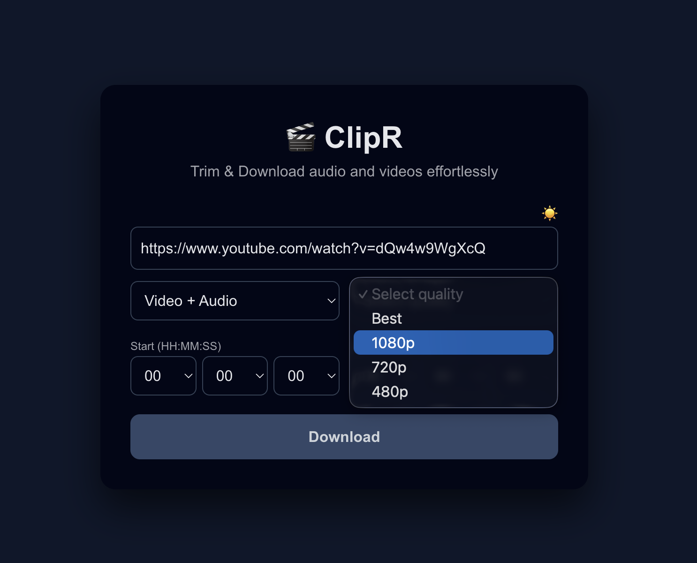
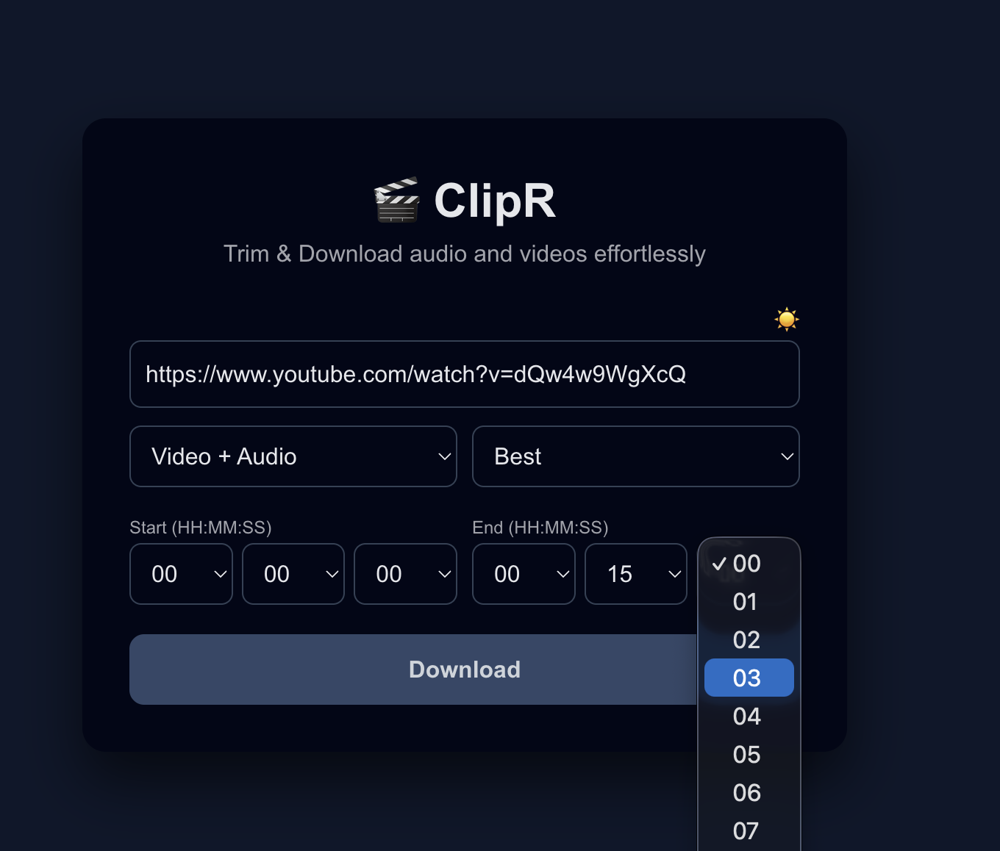

# 🎬 ClipR - Video Downloader

A modern web application for downloading and trimming videos from YouTube and Twitter (X). Built with Next.js frontend and Express.js backend.

**Repository:** [https://github.com/prateekx7/ClipR.git](https://github.com/prateekx7/ClipR.git)

## Features

- 📥 Download videos from YouTube and Twitter (X)
- 🎵 Extract audio only (MP3)
- 🎬 Download video only or video + audio
- 📊 Quality selection (Best, 1080p, 720p, 480p)
- ✂️ Trim videos with start and end timestamps
- 📈 Real-time download progress tracking
- 🌓 Dark/Light mode toggle
- 🎨 Modern and responsive UI

## Screenshots

<!-- Add your project screenshots here -->
<!-- Example format:


-->

### How to Add Screenshots

1. Create a `screenshots` folder in the root of your project
2. Add your screenshot images (PNG, JPG, or GIF format)
3. Update this section with markdown image syntax:
   ```markdown
   
   
   
   
   ```

**Example screenshots you might want to include:**
- Main interface (light mode)
- Main interface (dark mode)
- Download progress indicator
- Quality selection dropdown
- Time picker interface
- Success message after download

## Prerequisites

Before you begin, ensure you have the following installed on your system:

1. **Node.js** (v16 or higher) - [Download here](https://nodejs.org/)
2. **npm** (comes with Node.js) or **yarn**
3. **yt-dlp** - A command-line tool for downloading videos

### Installing yt-dlp

#### macOS
```bash
brew install yt-dlp
```

#### Linux
```bash
sudo pip install yt-dlp
# or
sudo apt install yt-dlp  # Ubuntu/Debian
```

#### Windows
```bash
pip install yt-dlp
# or download from: https://github.com/yt-dlp/yt-dlp/releases
```

Verify installation:
```bash
yt-dlp --version
```

## Installation

### 1. Clone the Repository

```bash
git clone https://github.com/prateekx7/ClipR.git
cd ClipR
```

### 2. Install Backend Dependencies

```bash
cd backend
npm install
```

### 3. Install Frontend Dependencies

```bash
cd ../frontend
npm install
```

## Running the Project

### Development Mode

You need to run both the backend and frontend servers simultaneously.

#### Terminal 1 - Backend Server

```bash
cd backend
node index.js
```

The backend will start on `http://localhost:3001`

#### Terminal 2 - Frontend Server

```bash
cd frontend
npm run dev
```

The frontend will start on `http://localhost:3000`

### Access the Application

Open your browser and navigate to:
```
http://localhost:3000
```

## Project Structure

```
download_YT_TWT_Videos/
├── backend/
│   ├── index.js              # Express server entry point
│   ├── routes/
│   │   └── download.js       # Download API routes
│   ├── util/
│   │   ├── downloader.js     # Core download logic
│   │   └── downloaderProgress.js  # Progress tracking
│   ├── temp/                 # Temporary download directory
│   └── package.json
├── frontend/
│   ├── app/
│   │   ├── page.tsx          # Main UI component
│   │   ├── layout.tsx        # App layout
│   │   └── globals.css       # Global styles
│   └── package.json
└── README.md
```

## Usage

1. **Enter URL**: Paste a YouTube or Twitter (X) video URL
2. **Select Type**: Choose between:
   - Video + Audio (default)
   - Video Only
   - Audio Only
3. **Choose Quality**: Select video quality (not applicable for audio)
4. **Set Timestamps** (optional): Set start and end times to trim the video
5. **Download**: Click the download button and wait for the file to download

## API Endpoints

### POST `/api/download`
Downloads a video based on the provided parameters.

**Request Body:**
```json
{
  "url": "https://youtube.com/watch?v=...",
  "type": "normal",
  "quality": "1080",
  "start": "00:01:30",
  "end": "00:05:00"
}
```

### GET `/api/download/progress`
Server-Sent Events (SSE) endpoint for real-time download progress.

**Query Parameters:**
- `url`: Video URL
- `type`: Download type (normal, video, audio)
- `quality`: Video quality (best, 1080, 720, 480)
- `start`: Start timestamp (HH:MM:SS)
- `end`: End timestamp (HH:MM:SS)

## Technologies Used

### Backend
- **Express.js** - Web framework
- **CORS** - Cross-origin resource sharing
- **yt-dlp** - Video downloader (system dependency)

### Frontend
- **Next.js 16** - React framework
- **React 19** - UI library
- **TypeScript** - Type safety

## Troubleshooting

### Backend not starting
- Ensure port 3001 is not in use
- Check that yt-dlp is installed and accessible in PATH
- Verify Node.js version is 16 or higher

### Downloads failing
- Verify the video URL is valid and accessible
- Check that yt-dlp is up to date: `yt-dlp -U`
- Ensure you have sufficient disk space in the `backend/temp/` directory

### Frontend not connecting to backend
- Ensure backend is running on port 3001
- Check CORS settings if accessing from a different origin
- Verify the API_BASE URL in `frontend/app/page.tsx`

## Notes

- Downloaded files are temporarily stored in `backend/temp/` and are automatically deleted after download
- The application requires an active internet connection
- Some videos may be restricted by the platform's terms of service


